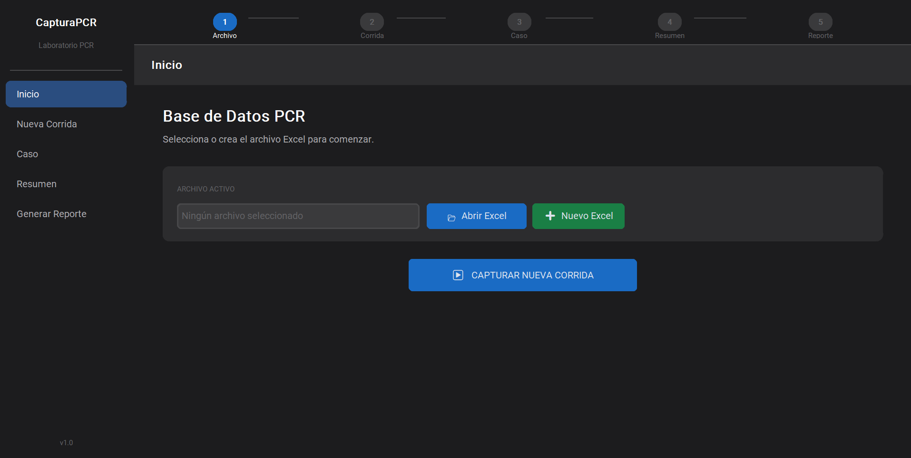
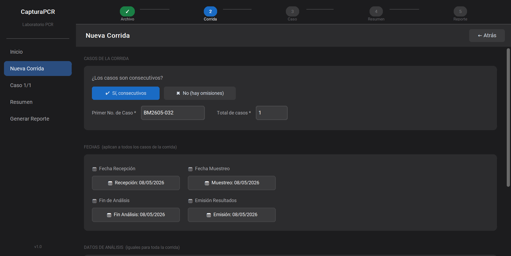
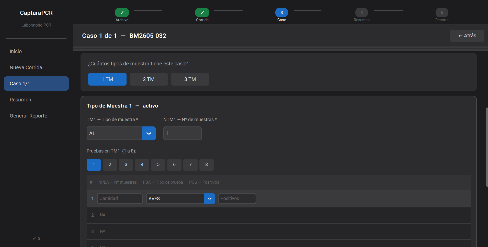
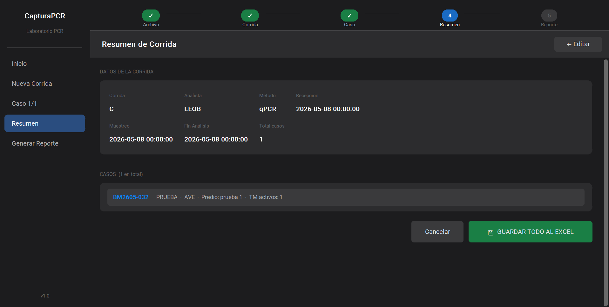
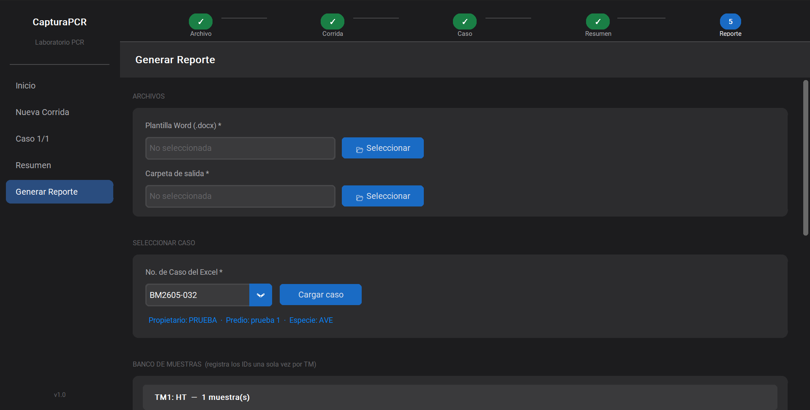

# 🧬 Laboratory Workflow Automation System


> **Note:** Due to organizational confidentiality policies, source code and production data are not included in this repository. This project is shared as a **professional portfolio showcase** demonstrating workflow automation, process design, and AI-assisted development.

---

## 📌 Overview

This project documents the design and implementation of an internal workflow automation system developed for a **Molecular Biology Laboratory** environment.

The initiative focused on improving operational efficiency by:

- Reducing repetitive manual tasks
- Minimizing data inconsistencies
- Integrating fragmented processes into a **centralized, automated workflow**

---

## 🔍 Problem Statement

The laboratory's previous workflow relied on multiple independent, manual processes:

| Pain Point | Impact |
|---|---|
| Manual data entry across systems | High error rate |
| Duplicate information capture | Wasted operational time |
| Spreadsheet-based management | Low traceability |
| Manual report generation | Slow turnaround |
| Cross-department validation | Redundant tasks |

---

## ✅ Proposed Solution

A **Python-based desktop application** was developed with AI-assisted support to centralize and streamline the entire workflow into a single integrated system.

### Key capabilities:

- **Visual Data Capture** — Organized forms with standardized fields for consistent data entry
- **Automated Report Generation** — Dynamic report creation reducing manual transcription
- **Workflow Integration** — Centralized information flow eliminating repetitive capture stages
- **Data Organization** — Structured handling with improved traceability and validation

---

## 🔄 Workflow Transformation

**Before — Fragmented Process:**

```
Manual Spreadsheet Database Capture
      ↓
Validation by Another Area
      ↓
Repeated Data Entry On Manual Report Creation
      ↓
Final Report Delivery
      ↓
Repeated Data Entry And Transform For Data Analysis
```

**After — Automated Process:**

```
Single Data Capture
      ↓
Centralized Processing
      ↓
Automatic Data Distribution
      ↓
Automated Report Generation
      ↓
Final Report Ready
      ↓
Data Ready For Data Analysis
```

---
## 🛠️ System Architecture



## 🖥️ Interface Preview

### Main Interface


### Run capture


### Case Management View

### Resume interface


### Report info capture


---

## 🛠️ Technologies Used

| Technology | Purpose |
|---|---|
| Python | Core application logic |
| Tkinter / CustomTkinter | Desktop GUI interface |
| pandas | Data processing and manipulation |
| openpyxl | Excel file handling and export |
| python-docx | Automated Word report generation |
| AI Development Tools | Code structuring, logic optimization, debugging |

---

## 🤖 AI-Assisted Development

Artificial Intelligence tools were used throughout the development lifecycle to support:

- Code structuring and architecture design
- Workflow logic optimization
- Debugging and error resolution
- Automation strategy development

This project demonstrates how AI tools can meaningfully accelerate the creation of practical solutions for operational and administrative challenges.

---

## 📈 Operational Impact

| Metric | Outcome |
|---|---|
| Manual data entry | Significantly reduced |
| Capture inconsistencies | Minimized through standardization |
| Report generation time | Faster turnaround |
| Workflow scalability | Improved for future growth |
| Process traceability | Enhanced across all stages |

---

## ⚠️ Confidentiality Notice

This repository does **not** include:

- Production source code
- Internal databases or records
- Client or patient information
- Sensitive operational data

All screenshots have been anonymized or modified for confidentiality purposes.

---

## 👤 Author

**Diego Soto**

Focused on process automation, data workflows, operational optimization, and AI-assisted development using Python-based solutions.

[](https://www.linkedin.com/in/diego-alonso-soto-galaviz-67ba9a196)

---

*This repository is shared for portfolio and educational purposes only.*
